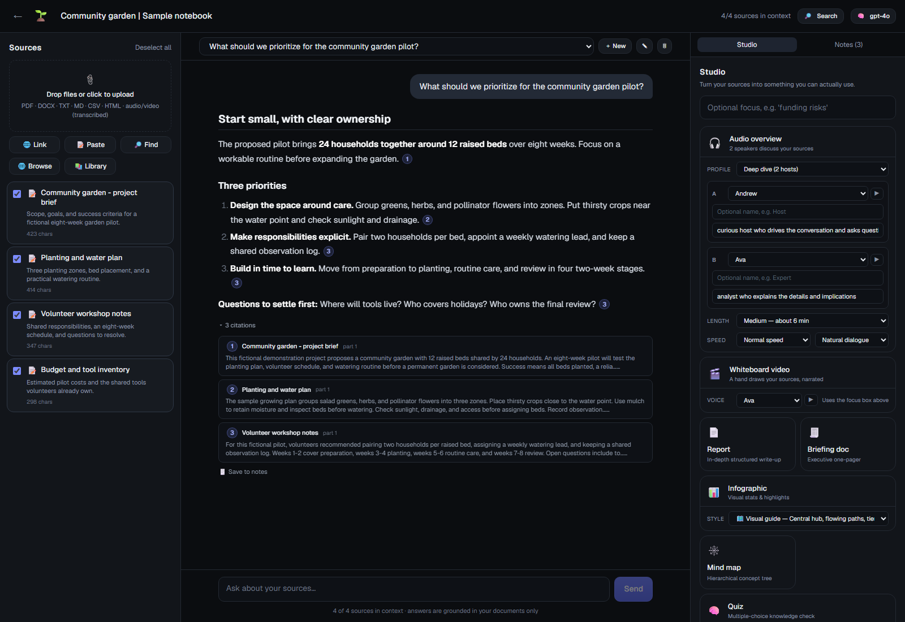
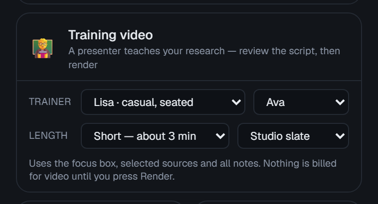
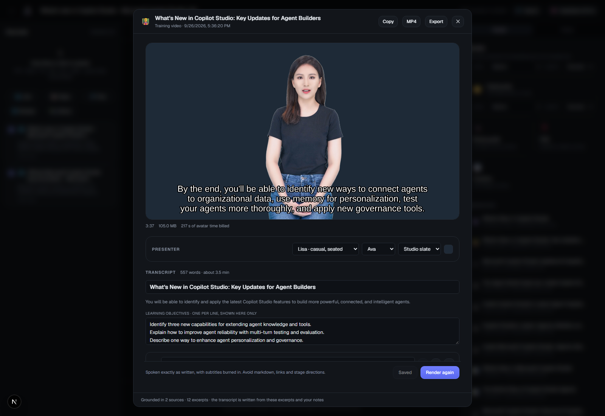

# InfiniAIBook

[](https://github.com/russrimm/InfiniAIBook/actions/workflows/ci.yml)
[](LICENSE)

A self-hosted Agentic Powered Notebook research studio. Upload your own sources, chat with
them, talk them through out loud, and turn them into **reports, briefings,
PowerPoint decks, infographics, mind maps, quizzes, flashcards, study guides,
FAQs, timelines, audio overviews, whiteboard videos, motion explainers and
avatar training videos**. Every claim is cited back to the document it came from.

Built with Next.js 15, TypeScript and SQLite. Runs against Azure OpenAI, a dozen
named providers (OpenAI, Anthropic, Gemini, Groq, Mistral, DeepSeek, OpenRouter,
xAI, Perplexity, Together) or any OpenAI-compatible endpoint, including local
models via Ollama, llama.cpp or LM Studio.

Inspired by [open-notebook](https://github.com/lfnovo/open-notebook).

> **Single-user.** Without `INFINIAIBOOK_PASSWORD`, anyone who can reach the
> server can use it, and your model quota with it. It listens on localhost only
> by default; set a password before using `npm run dev:lan`, or put it behind an
> authenticating proxy — see [SECURITY.md](SECURITY.md).



More in the [screenshot tour](docs/screenshots.md).

### Sample: an avatar training video

The 🧑‍🏫 **Training video** generator turns a notebook's sources and notes into an
editable trainer's script, then renders it with an Azure AI Foundry
text-to-speech avatar: a lip-synced presenter with burned-in subtitles, signed
in with Microsoft Entra ID. This 3:37 sample came from a notebook of two public
"What's new in Copilot Studio" pages. It rendered in about four and a half
minutes.

https://github.com/user-attachments/assets/7651fdca-42dd-45e4-8e56-f56f07c3b6d9

| Pick a presenter, voice, length and background | Review the script, render, and play or download the MP4 |
|---|---|
|  |  |

How it works, setup and costs: [Training videos](docs/training-videos.md).

## Features

- **Sources** — PDF, DOCX, TXT, MD, CSV, JSON, HTML, images, audio/video, pasted
  text, URLs, YouTube links and RSS/Atom feeds; discover sources from a topic,
  browse the web in-app, or reuse a source from another notebook. Uploads are
  processed in the background, and linked sources are re-checked for changes.
  [More](docs/sources.md)
- **Grounded chat** — streaming answers built only from your selected sources,
  with clickable inline citations that open the highlighted passage, **Stop**
  that keeps the partial answer, and multiple chat sessions per notebook.
- **Notes and transformations** — Markdown notes, saved chat answers (citations
  kept), notes turned into sources, and reusable prompts run on a source.
  [More](docs/notes-and-search.md)
- **Live discussions** — talk through your sources out loud: discuss, debate,
  Q&A, interview an expert, get interviewed, an oral quiz or a Socratic tutor.
  The AI answers in real time, lets you interrupt, looks things up in your
  sources mid-conversation and shows clickable citations. Save the call as a
  note with takeaways. [More](docs/discussions.md)
- **Search everything** — keyword or semantic search, and a grounded **Ask**,
  across every notebook. [More](docs/notes-and-search.md#search-and-ask)
- **Screen helper** — share any app's window, type what you need help with,
  and get coached one step at a time, with the next control highlighted on a
  screenshot. Auto-watch notices when you have done a step and suggests the
  next. [More](docs/screen-helper.md)
- **Studio** — fourteen generators, each producing a structured, interactive artifact:

  | Format | Output |
  |---|---|
  | 🎧 [Audio overview](docs/audio-overviews.md) | One to four speakers discuss your sources, with a synced transcript |
  | 🎬 [Whiteboard video](docs/whiteboard-videos.md) | A narrated, hand-drawn explainer, MP4 |
  | 🎞️ [Motion explainer](docs/motion-explainers.md) | A narrated 2D animated explainer (problem → solution → how → benefits → next step), MP4. [Customize](docs/motion-explainers.md#customizing-a-video) the length, tone, audience, illustration style, colors, character, closing call to action, resolution and character motion |
  | 🧑‍🏫 [Training video](docs/training-videos.md) | An editable trainer's script from sources and notes, rendered by a lip-synced Azure avatar presenter, MP4 |
  | 📽️ [PowerPoint deck](docs/studio.md#powerpoint-deck) | Title, agenda, content slides with speaker notes and a sources slide; download as PPTX |
  | 📊 [Infographic](docs/infographics.md) | **33 styles**, each with a live example in the style gallery before you generate — timelines, funnels, pyramids, cycles, myth vs fact, pros & cons, cheat sheets, kawaii, bricks and AI-drawn anime, retro print and paper craft among them. Pick the shape (landscape, portrait, square), the level of detail, describe what you want, or ask for styles that suit your sources |
  | 🕸️ [Mind map](docs/studio.md#mind-maps) | Interactive, expandable concept tree |
  | 🧠 [Quiz](docs/studio.md#quiz) · 🗂️ [Flashcards](docs/studio.md#flashcards) | Scored quizzes and self-graded decks |
  | 📄 Report · 🧾 Briefing · 🎓 Study guide · ❓ FAQ · 🗓️ Timeline | Structured written summaries |

  Audio overviews and all three video formats stop at an **editable script**
  before anything is narrated or rendered, accept **narration instructions**
  and a **word-replacement list** (for terms to avoid, translation or a
  different register), and can add **background music** you upload.
  [More](docs/studio.md#spoken-formats-script-review-instructions-and-music)

- **Exports** — Markdown, PPTX, MP3, MP4, PNG and Anki/Quizlet CSV. [More](docs/studio.md#exporting)
- **Model picker** — switch the chat, embedding, image and vision models from
  the workspace header; a saved choice overrides the environment until reset.
  [More](docs/configuration.md#models-and-what-theyre-used-for)
- **Undo deletes** — deleted sources, notes, chats, artifacts and notebooks can
  be restored for 8 seconds.
- **Reduced motion** — honors the OS or browser `prefers-reduced-motion`
  setting: entrances fade instead of moving, spinners and mind maps stop
  animating, and scrolling jumps instead of gliding.
- **Everything is local** — sources, embeddings, chat history, artifacts and
  media live under `.data/`. Password protection and a Docker image included.

See the [full feature list](docs/features.md) for details.

## Quick start

Requires **Node.js 22.13+** and a model provider.

```bash
npm install
cp .env.example .env.local   # then configure a provider
npm run dev
```

Open <http://localhost:3000>. See [Getting started](docs/getting-started.md) for
Docker and password protection, and [Configuration](docs/configuration.md) for
providers and environment variables.

### Models and what they're used for

Only a chat model is required; each of the others switches features on. Azure
settings are shown here; other providers use the `AI_*` equivalents. The
[full table](docs/configuration.md#models-and-what-theyre-used-for) covers
defaults and what happens without each one.

| Model | Setting | Used for |
|---|---|---|
| Chat (required) | `AZURE_OPENAI_DEPLOYMENT` or `AI_MODEL` | Chat, search Ask, notes and transformations, and the written Studio formats |
| Studio script | `AI_STUDIO_MODEL` (optional, defaults to chat) | Audio-overview scripts, whiteboard and motion scene plans, training transcripts |
| Embeddings | `AZURE_OPENAI_EMBEDDING_DEPLOYMENT` or `AI_EMBEDDING_MODEL` | Semantic retrieval and search; keyword ranking without it |
| Image | `AZURE_OPENAI_IMAGE_DEPLOYMENT` or `AI_IMAGE_MODEL` | AI-image infographics, whiteboard videos and motion explainers |
| Vision | `AZURE_OPENAI_VISION_DEPLOYMENT` or `AI_VISION_MODEL` | Reading uploaded images and the screen helper (defaults to chat) |
| Transcription | `AZURE_OPENAI_TRANSCRIPTION_DEPLOYMENT` or `AI_TRANSCRIPTION_MODEL` | Audio and video sources |
| Realtime voice | `AZURE_OPENAI_REALTIME_DEPLOYMENT` or `AI_REALTIME_MODEL` | Live discussions |
| Azure Speech | `AZURE_SPEECH_REGION` + `AZURE_SPEECH_RESOURCE_ID` (or `AZURE_SPEECH_KEY`) | Every voice: audio overviews, video narration, training-video avatars |
| Gemini | `GEMINI_API_KEY` | YouTube transcripts |

Whiteboard videos and motion explainers also need Python 3 with `numpy`,
`Pillow` and `imageio-ffmpeg`.

## Documentation

Full documentation is in [docs/](docs/README.md), including
[how grounding works](docs/grounding.md), the [architecture](docs/architecture.md)
and the [REST API](docs/API.md).

## Contributing

See [CONTRIBUTING.md](CONTRIBUTING.md) for development setup and the checks to
run before a pull request, and the [Code of Conduct](CODE_OF_CONDUCT.md). Report
security issues privately as described in [SECURITY.md](SECURITY.md).

## License

[MIT](LICENSE)
